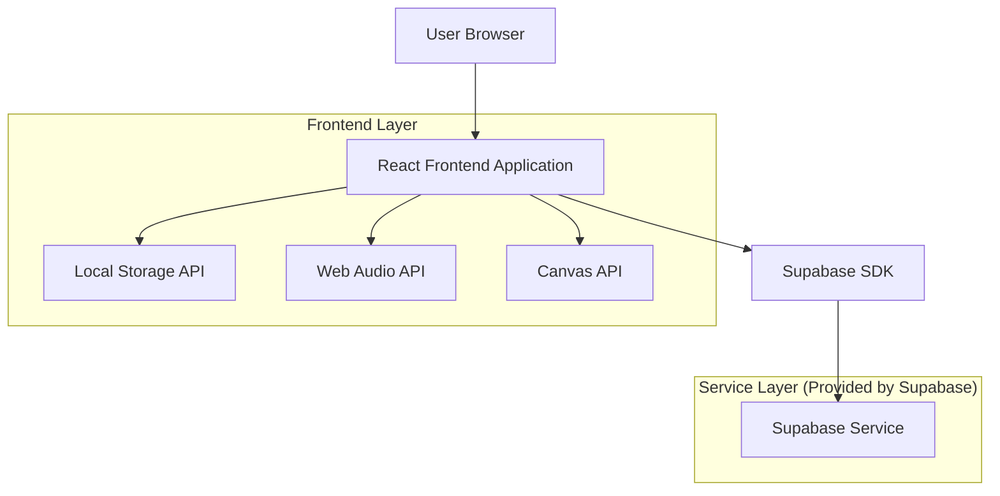
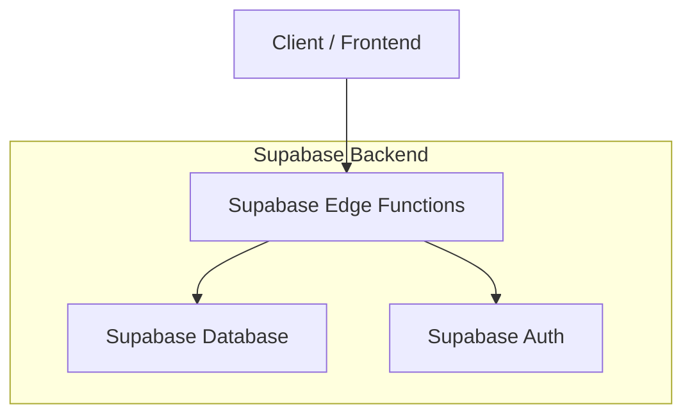
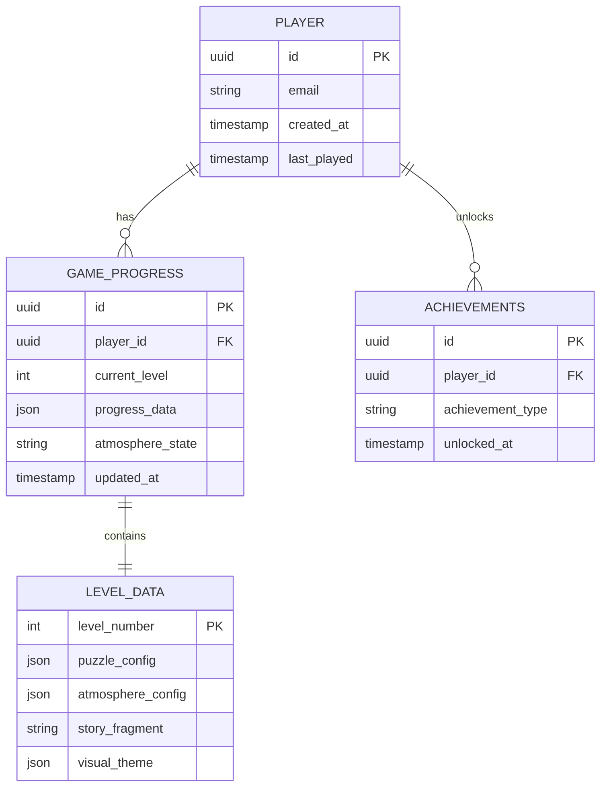

# Mysterious Puzzle Game - Technical Architecture Document

## 1. Architecture Design



## 2. Technology Description

* Frontend: React\@18 + TypeScript + Tailwind CSS + Vite

* Backend: Supabase (optional for cloud saves)

* Game Engine: Custom React-based with Canvas API for advanced visual effects

* Audio: Web Audio API for dynamic soundscapes

* Storage: Local Storage (primary) + Supabase (optional cloud sync)

## 3. Route Definitions

| Route              | Purpose                                                         |
| ------------------ | --------------------------------------------------------------- |
| /                  | Main menu with game title, start/continue options, and settings |
| /game              | Main game interface with puzzle board and atmospheric elements  |
| /game/:level       | Specific level gameplay with dynamic difficulty and atmosphere  |
| /transition/:level | Level transition screen with story fragments                    |
| /settings          | Game settings including audio, visual, and progress options     |
| /credits           | Game credits and acknowledgments                                |

## 4. API Definitions (Optional Cloud Features)

### 4.1 Core API

Player progress synchronization (optional)

```
POST /api/progress/save
```

Request:

| Param Name     | Param Type | isRequired | Description              |
| -------------- | ---------- | ---------- | ------------------------ |
| player\_id     | string     | true       | Unique player identifier |
| level          | number     | true       | Current level number     |
| progress\_data | object     | true       | Serialized game state    |
| timestamp      | string     | true       | Save timestamp           |

Response:

| Param Name | Param Type | Description            |
| ---------- | ---------- | ---------------------- |
| success    | boolean    | Save operation status  |
| sync\_id   | string     | Unique sync identifier |

Example:

```json
{
  "player_id": "player_123",
  "level": 15,
  "progress_data": {
    "completed_levels": [1,2,3,4,5,6,7,8,9,10,11,12,13,14,15],
    "atmosphere_state": "dark_transition",
    "story_fragments_seen": ["intro", "first_hint", "growing_unease"]
  },
  "timestamp": "2024-01-15T10:30:00Z"
}
```

## 5. Server Architecture Diagram (Optional Cloud Features)



## 6. Data Model

### 6.1 Data Model Definition



### 6.2 Data Definition Language

Player Progress Table (game\_progress)

```sql
-- Create table for game progress
CREATE TABLE game_progress (
    id UUID PRIMARY KEY DEFAULT gen_random_uuid(),
    player_id UUID REFERENCES auth.users(id) ON DELETE CASCADE,
    current_level INTEGER DEFAULT 1,
    progress_data JSONB DEFAULT '{}',
    atmosphere_state VARCHAR(50) DEFAULT 'cheerful',
    completed_levels INTEGER[] DEFAULT ARRAY[]::INTEGER[],
    story_fragments_seen TEXT[] DEFAULT ARRAY[]::TEXT[],
    created_at TIMESTAMP WITH TIME ZONE DEFAULT NOW(),
    updated_at TIMESTAMP WITH TIME ZONE DEFAULT NOW()
);

-- Create indexes
CREATE INDEX idx_game_progress_player_id ON game_progress(player_id);
CREATE INDEX idx_game_progress_level ON game_progress(current_level);
CREATE INDEX idx_game_progress_updated ON game_progress(updated_at DESC);

-- Level configuration table
CREATE TABLE level_config (
    level_number INTEGER PRIMARY KEY,
    puzzle_type VARCHAR(50) NOT NULL,
    difficulty_rating INTEGER DEFAULT 1,
    atmosphere_theme VARCHAR(50) DEFAULT 'cheerful',
    visual_config JSONB DEFAULT '{}',
    audio_config JSONB DEFAULT '{}',
    story_fragment TEXT,
    unlock_requirements JSONB DEFAULT '{}'
);

-- Achievements table
CREATE TABLE achievements (
    id UUID PRIMARY KEY DEFAULT gen_random_uuid(),
    player_id UUID REFERENCES auth.users(id) ON DELETE CASCADE,
    achievement_type VARCHAR(100) NOT NULL,
    achievement_data JSONB DEFAULT '{}',
    unlocked_at TIMESTAMP WITH TIME ZONE DEFAULT NOW()
);

-- Row Level Security
ALTER TABLE game_progress ENABLE ROW LEVEL SECURITY;
ALTER TABLE achievements ENABLE ROW LEVEL SECURITY;

-- Policies
CREATE POLICY "Users can view own progress" ON game_progress
    FOR SELECT USING (auth.uid() = player_id);

CREATE POLICY "Users can update own progress" ON game_progress
    FOR ALL USING (auth.uid() = player_id);

CREATE POLICY "Users can view own achievements" ON achievements
    FOR SELECT USING (auth.uid() = player_id);

CREATE POLICY "Users can insert own achievements" ON achievements
    FOR INSERT WITH CHECK (auth.uid() = player_id);

-- Grant permissions
GRANT SELECT ON level_config TO anon;
GRANT ALL PRIVILEGES ON game_progress TO authenticated;
GRANT ALL PRIVILEGES ON achievements TO authenticated;

-- Insert initial level configurations
INSERT INTO level_config (level_number, puzzle_type, difficulty_rating, atmosphere_theme, story_fragment) VALUES
(1, 'sliding_tiles', 1, 'cheerful', 'Welcome to a world of colorful puzzles...'),
(2, 'pattern_match', 1, 'cheerful', 'Everything seems so bright and happy here.'),
(3, 'logic_grid', 2, 'cheerful', 'The patterns are becoming more interesting...'),
(4, 'sliding_tiles', 2, 'cheerful', 'Something feels... different today.'),
(5, 'memory_sequence', 2, 'cheerful', 'Did the colors always look this way?'),
(10, 'complex_logic', 4, 'unsettling', 'The shadows are growing longer...'),
(15, 'timed_pressure', 6, 'dark_transition', 'Time is running out. Always running out.'),
(20, 'psychological', 8, 'horror', 'You should not have come this far.');
```

## 7. Game Engine Architecture

### 7.1 Core Components

* **GameEngine**: Main game loop and state management

* **PuzzleRenderer**: Canvas-based puzzle visualization

* **AtmosphereController**: Dynamic visual and audio atmosphere

* **ProgressManager**: Level progression and save system

* **StoryEngine**: Narrative fragment delivery system

* **AudioManager**: Dynamic soundscape and effect management

### 7.2 State Management

```typescript
interface GameState {
  currentLevel: number;
  puzzleState: PuzzleData;
  atmosphereLevel: AtmosphereType;
  storyProgress: StoryFragment[];
  playerProgress: ProgressData;
  audioState: AudioConfig;
}

type AtmosphereType = 'cheerful' | 'neutral' | 'unsettling' | 'dark_transition' | 'horror';
```

### 7.3 Performance Considerations

* Canvas rendering optimized for 60fps

* Progressive asset loading for atmosphere transitions

* Efficient audio context management

* Local storage caching for offline play

* Lazy loading of advanced visual effects

