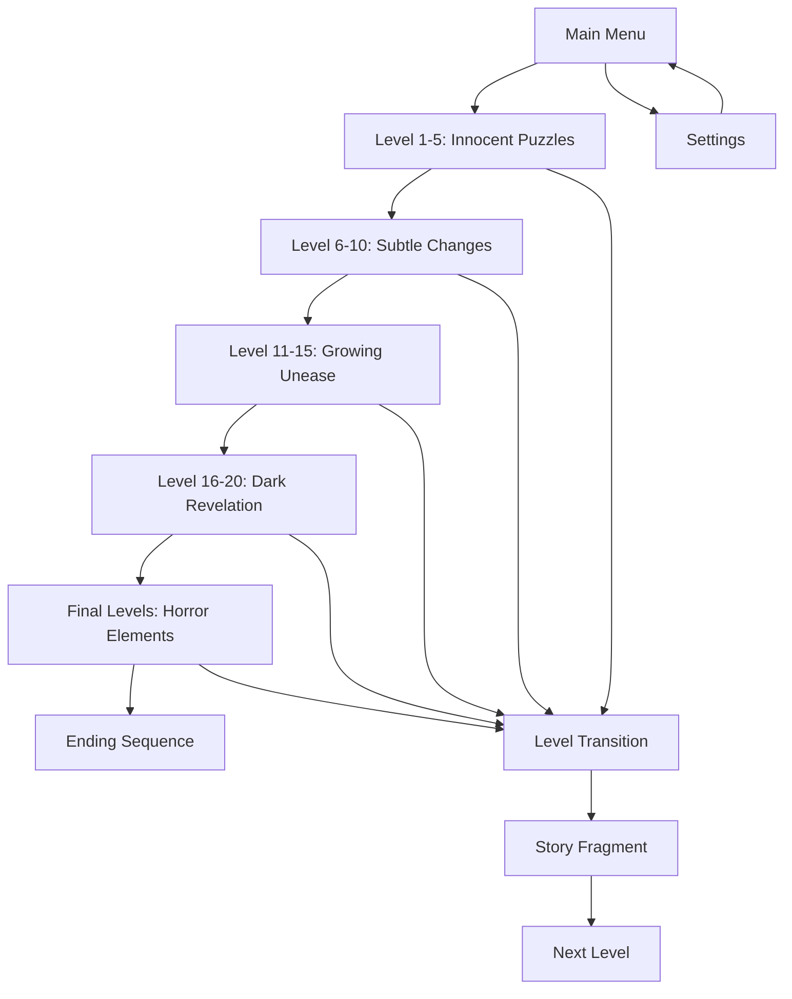

# Mysterious Puzzle Game - Product Requirements Document

## 1. Product Overview

A deceptively simple web-based puzzle game that begins as a cheerful, colorful experience but gradually transforms into a psychological horror adventure as players progress through levels.

The game targets puzzle enthusiasts and horror fans who enjoy narrative-driven experiences, solving the problem of predictable puzzle games by introducing an evolving atmosphere that keeps players engaged through mystery and psychological tension.

## 2. Core Features

### 2.1 User Roles

| Role              | Registration Method         | Core Permissions                                |
| ----------------- | --------------------------- | ----------------------------------------------- |
| Player            | No registration required    | Can play all levels, save progress locally      |
| Registered Player | Optional email registration | Can save progress to cloud, unlock achievements |

### 2.2 Feature Module

Our mysterious puzzle game consists of the following main pages:

1. **Main Menu**: game title, start/continue buttons, settings, credits
2. **Game Board**: puzzle interface, level indicator, hint system, atmospheric elements
3. **Level Transition**: story fragments, visual transitions, progress indicators
4. **Settings**: audio controls, graphics options, reset progress

### 2.3 Page Details

| Page Name        | Module Name       | Feature description                                                                      |
| ---------------- | ----------------- | ---------------------------------------------------------------------------------------- |
| Main Menu        | Title Screen      | Display game logo with subtle animations, background music that hints at darker themes   |
| Main Menu        | Navigation        | Start new game, continue from last level, access settings and credits                    |
| Game Board       | Puzzle Interface  | Interactive grid-based puzzle mechanics (sliding tiles, pattern matching, logic puzzles) |
| Game Board       | Atmosphere System | Dynamic background, lighting effects, and audio that evolve based on current level       |
| Game Board       | Hint System       | Progressive hint system that becomes more cryptic and unsettling in later levels         |
| Game Board       | Progress Tracking | Level counter, completion status, hidden corruption indicators                           |
| Level Transition | Story Fragments   | Brief text or visual snippets that reveal the mysterious narrative                       |
| Level Transition | Visual Evolution  | Gradual transition from bright, cheerful graphics to darker, more ominous visuals        |
| Settings         | Audio Controls    | Master volume, music/SFX toggles, with hidden audio cues in advanced levels              |
| Settings         | Visual Options    | Brightness, contrast, fullscreen toggle, accessibility options                           |

## 3. Core Process

**Player Flow:**
Players start with simple, colorful puzzles that gradually introduce darker elements. Each completed level reveals small story fragments while the visual and audio design slowly shifts from cheerful to ominous. The puzzle mechanics themselves become more complex and psychologically challenging, with some levels featuring time pressure or disturbing imagery that affects gameplay.

## 4. User Interface Design

### 4.1 Design Style

* **Primary Colors**: Start with bright pastels (#FFE5B4, #B4E5FF, #E5FFB4) that gradually shift to darker tones (#2C1810, #1A1A2E, #16213E)

* **Button Style**: Initially rounded, friendly buttons that become more angular and sharp-edged in later levels

* **Font**: Clean, readable sans-serif (Roboto) that occasionally glitches or distorts in advanced levels

* **Layout Style**: Card-based design with generous whitespace that becomes more cramped and claustrophobic

* **Icons**: Simple, cheerful icons (🌟⭐🎯) that gradually transform into more ominous symbols (🔍👁️⚠️)

### 4.2 Page Design Overview

| Page Name        | Module Name   | UI Elements                                                                                        |
| ---------------- | ------------- | -------------------------------------------------------------------------------------------------- |
| Main Menu        | Title Screen  | Large, friendly title with subtle shadow effects, animated background particles that slowly darken |
| Main Menu        | Navigation    | Bright, inviting buttons with hover animations, background music with hidden undertones            |
| Game Board       | Puzzle Grid   | Clean 4x4 or 5x5 grid with smooth animations, tiles that gradually show wear or corruption         |
| Game Board       | UI Elements   | Progress bar, level indicator, hint button with consistent styling that subtly degrades            |
| Level Transition | Story Display | Centered text boxes with typewriter effect, background that slowly shifts from light to dark       |
| Settings         | Control Panel | Standard toggle switches and sliders with clean, accessible design                                 |

### 4.3 Responsiveness

Desktop-first design optimized for mouse interaction, with mobile-adaptive layout for touch devices. The game maintains its atmospheric progression across all screen sizes, with touch-optimized puzzle interactions for mobile users.

## 5. Atmospheric Progression System

### 5.1 Visual Evolution

* **Levels 1-5**: Bright, saturated colors with cheerful animations

* **Levels 6-10**: Slight desaturation, introduction of shadows

* **Levels 11-15**: Muted colors, flickering effects, subtle visual glitches

* **Levels 16-20**: Dark themes, distorted elements, unsettling imagery

* **Final Levels**: Full horror aesthetic with psychological elements

### 5.2 Audio Progression

* **Early Levels**: Upbeat, puzzle-game music with pleasant sound effects

* **Mid Levels**: Music becomes more ambient, introduction of subtle discordant notes

* **Later Levels**: Minimalist, tension-building soundscape with psychological audio cues

* **Final Levels**: Full horror audio with environmental sounds and whispers

### 5.3 Narrative Elements

* **Story Fragments**: Brief text snippets revealed between levels

* **Environmental Storytelling**: Visual clues within puzzle elements

* **Meta-Narrative**: Game interface itself becomes part of the story

* **Multiple Endings**: Player choices in later levels affect the conclusion

